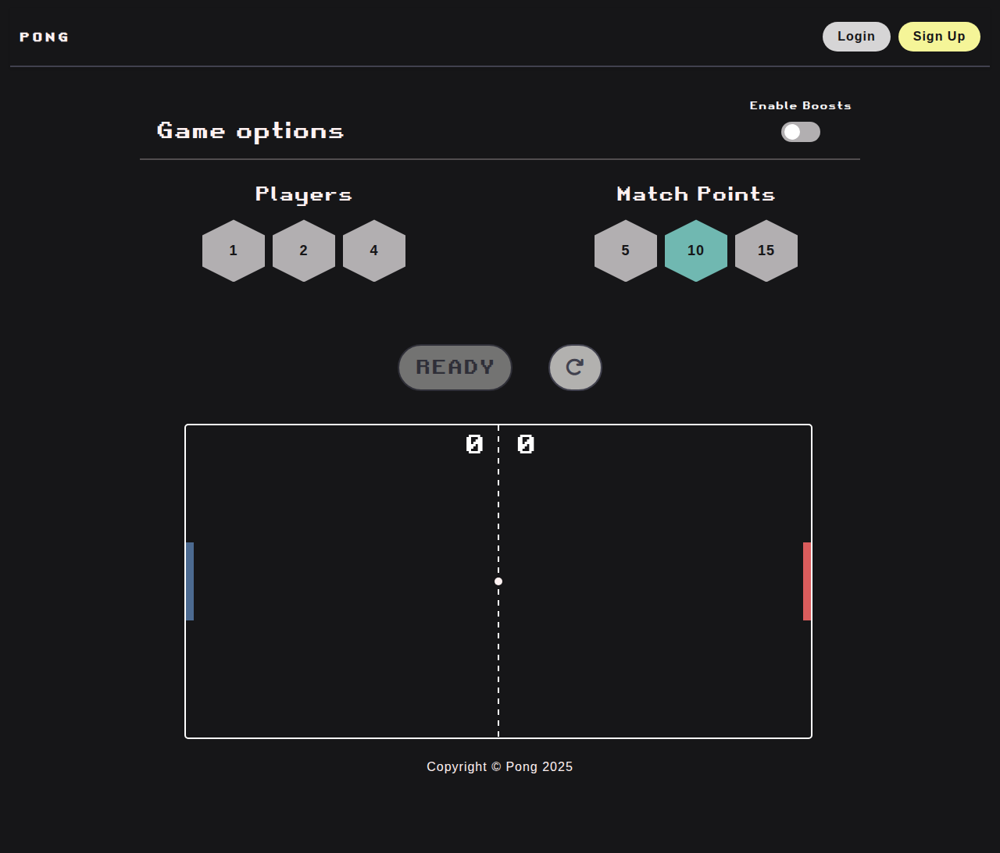

# ft_transcendence — Pong

A web-based Pong game built as a single-page app, with local and 42 Intra authentication, two-factor authentication, and service monitoring.



## Features

- Local Pong for 1, 2 or 4 players, with configurable match points and optional boosts
- Tournament mode
- Sign up / log in with email and password, or with your 42 account (OAuth)
- Two-factor authentication (TOTP with QR setup)
- Multi-language UI: English, Spanish, French
- Monitoring with Prometheus and Grafana

## Stack

| Service      | Tech                         | Port   |
|--------------|------------------------------|--------|
| `frontend`   | Apache + HTML/JS + Bootstrap | `8443` |
| `auth-local` | Django (local auth + 2FA)    | `8441` |
| `auth-42`    | Django (42 OAuth)            | `8442` |
| `db`         | PostgreSQL 15                | —      |
| `prometheus` | Prometheus                   | `9090` |
| `grafana`    | Grafana                      | `3000` |

## Requirements

- Docker and Docker Compose
- GNU Make
- A 42 API application (`CLIENT_ID`, `CLIENT_SECRET`, `REDIRECT_URI`) in `auth-42/.env` if you want 42 login

## Running

```bash
make            # build and start all containers
```

Then open **https://localhost:8443**. The certificate is self-signed, so your browser will show a warning you need to accept.

Useful targets:

```bash
make status     # containers, images and volumes
make logs       # follow logs
make stop       # stop containers
make restart    # restart everything
make restart-service SERVICE=auth-42
make build      # rebuild images without cache
make clean      # remove containers, images and volumes
make re         # full clean and restart
```

## License

[MIT](LICENSE)

---

Made by [ddel-bla](https://github.com/ddel-bla), [cfeliz-r](https://github.com/cfeliz-r) [lvarela](https://github.com/luisenrique-varelarodriguez) and [fernandezclau](https://github.com/fernandezclau).
